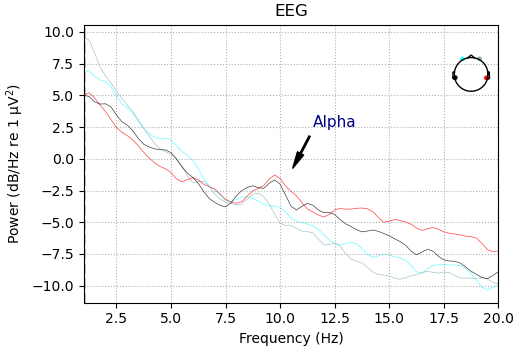
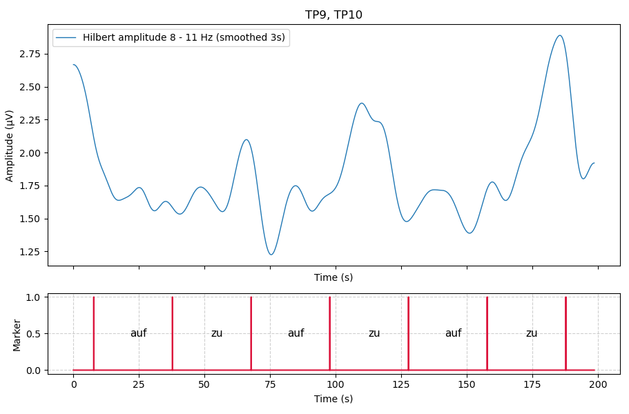
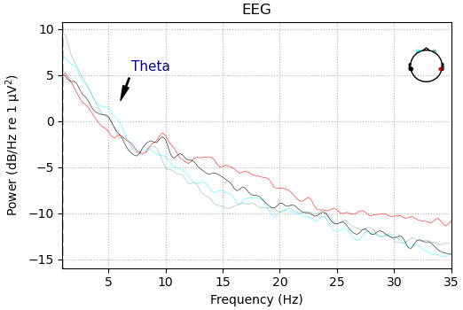
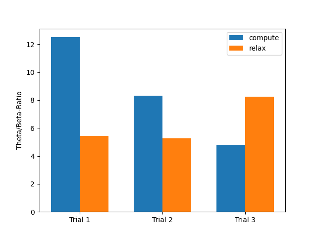

# Muse Athena

## Alpha
Prozedur: 6 x 30 Sekunden Aufnahme, abwechselnd Augen auf und Augen zu. Auswertung: Entfernen von Blinzelartefakten, Ausgabe des Spektrums zur Selektion relevanter Frequenzen und Elektroden, Hilbert-Amplitude über relevante Frequenzen (mit Glättung). Je höher die Amplitude, desto stärker die Alpha-Aktivität.

Das Frequenzspektrum zeigt an den posterioren Elektroden TP9 und TP10 einen klaren Peak im Alpha-Band, hier insbesondere zwischen 8 und 11 Hz. Die Hilbert-Amplitude, gemittelt über diese Elektroden, zeigt den erwarteten Anstieg der Alphapower nach Schließen der Augen (etwas zeitverzögert) und einen schnellen Abfall nach Öffnen der Augen.

## Theta / Beta ratio
Prozedur: 6 x 30 Sekunden Aufnahme, abwechselnd Konzentration (Kopfrechnen) und Entspannung. Auswertung: Entfernen von Blinzelartefakten, Ausgabe des Spektrums zur Selektion relevanter Frequenzen und Elektroden. Errechnen der mittleren Theta (4 bis 7 Hz) - und Beta (13 bis 30 Hz) - Power, Darstellung als Balkendiagramm.

Elektrode AF7 wurde ausgewählt, weil sie insgesamt höhere Theta-Power zeigte als die anderen Elektroden. Erwartet wurde ein niedrigeres Theta/Beta-Verhältnis bei Konzentration und ein hohes Verhältnis bei Entspannung. Die Ergebnisse entsprachen nur im dritten Durchgang der Erwartung. 

